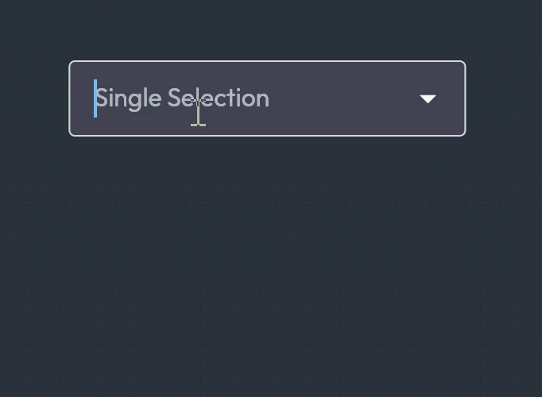
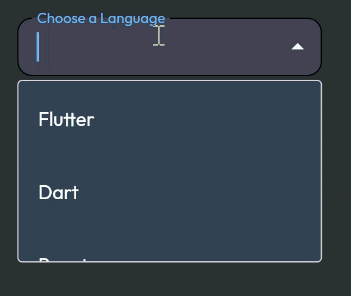
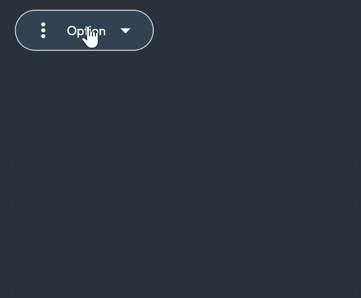

# Changelog

All notable changes to this project will be documented in this file.

The format is based on [Keep a Changelog](https://keepachangelog.com/en/1.0.0/),
and this project adheres to [Semantic Versioning](https://semver.org/spec/v2.0.0.html).

# [Dropdown Implementation] - 2025-10-23
## Added
- `Dropdowns.select()`   - Single-selection dropdown
- `Dropdowns.multiSelect()` - Multi-selection dropdown with checkboxes
- `Dropdowns.combobox()` - Searchable dropdown with custom option builders
- `Dropdowns.menu()` - Action menu dropdown for context menus

### Features
#### `Dropdowns.select()`   - Single-selection dropdown
- [x] Single selection from a list of options  
- [x] Support for different sizes (sm, md, lg) 
- [x] Various states: default, focused, disabled, error
- [x] Searchable option filtering

##### Example Usage
```dart
Dropdowns.select(
      size: dropdownSize,
      label: "Single select",
      textStyle: labelStyle,
      state: dropdownState,
      errorMessage: "You have an error",
      selectedValue: selectedValue,
      isSearchable: isSearchable,
      withBorder: withBorder,
      options: ['USA', 'Canada', 'Mexico'],
      onSelectedValueChanged: (value) {
        setState(() {
          selectedValue = value;
        });
      },
    )
```

#### `Dropdowns.multiSelect()` - Multi-selection dropdown
- [x] Multiple selection with checkboxes 
- [x] Selected items display (chips/tags)
- [x] Clear all functionality
- [x] Select all/none options

##### Example Usage
```dart
Dropdowns.multiSelect(
      label: "Multiselection Combobox",
      size: dropdownSize,
      textStyle: labelStyle,
      state: dropdownState,
      errorMessage: "Error Message",
      selectAllText: "Select All",
      clearAllText: "Clear All",
      selectedValues: selectedValues,
      isSearchable: isSearchable,
      withBorder: withBorder,
      options: ['Flutter', 'Dart', 'React', 'Node.js', 'Python', 'R', 'C++'],
      onSelectedValueChanged: (value) {
        setState(() {
          selectedValues.add(value);
        });
      },
    )
```

####  `Dropdowns.combobox()` - Searchable dropdown
- [x] Add new option functionality
- [x] Type to filter option

```dart
Dropdowns.combobox(
      label: "Combobox Dropdown",
      size: dropdownSize,
      textStyle: labelStyle,
      errorMessage: "Hello I am an Error",
      state: dropdownState,
      isSearchable: isSearchable,
      withBorder: withBorder,
      options: ['Flutter', 'Dart', 'React', 'Node.js'],
      onSelectedValueChanged: (value) {
        debugPrint("You selected $value");
      },
    )
```

####  `Dropdowns.menu()` - Action menu dropdown
- [x] Dividers and group support
- [x] Icons and descriptions

```dart
 Dropdowns.menu(
      label: "My options",
      leadingIcon: Icon(Icons.more_vert),
      trailingIcon: Icon(Icons.arrow_drop_down),
      textStyle: labelStyle,
      size: dropdownSize,
      state: dropdownState,
      withBorder: withBorder,
      divider: true,
      actionMenuGroups: [
        MenuDropdownItemGroup(
          groupTitle: "Mr File",
          groupItems: [
            MenuDropdownItem(
              label: "New File",
              icon: Icon(Icons.add),
              onTap: () {
                debugPrint("You pressed New");
              },
            ),
            MenuDropdownItem(
              label: "Mr Open",
              icon: Icon(Icons.folder_open),
              onTap: () {
                debugPrint("You pressed Open");
              },
            ),
          ],
        ),
      ],
    )
```

Icons and descriptions in options
\n## [0.1.3] - 2025-09-01


\n## [0.1.4] - 2025-09-01


\n## [0.1.5] - 2025-09-01


\n## [0.1.6] - 2025-09-02


\n## [0.1.7] - 2025-09-04


\n## [0.1.8] - 2025-09-05


\n## [0.1.9] - 2025-09-05


\n## [0.1.10] - 2025-09-07


\n## [0.1.11] - 2025-09-08


\n## [0.1.12] - 2025-09-09


\n## [0.1.13] - 2025-09-11


\n## [0.1.14] - 2025-09-18


\n## [0.1.15] - 2025-09-30


\n## [0.1.16] - 2025-10-01


\n## [0.1.17] - 2025-10-01


\n## [0.2.0] - 2025-10-01


\n## [0.2.1] - 2025-10-01

